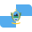
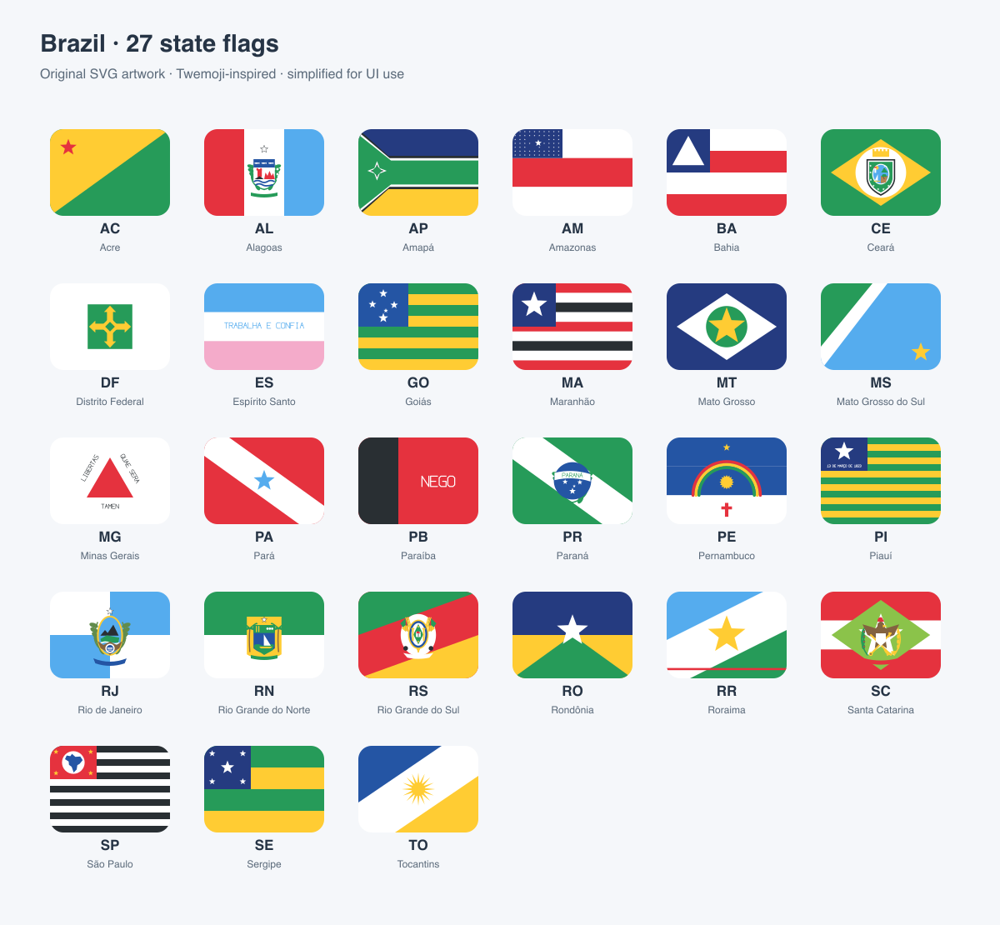

<div align="center">




# Tweemoji Brazil State Flags

**A little Brazil in every interface.**

27 original, Twemoji-inspired flags for Brazil's 26 states and Distrito Federal.<br />
Editable SVGs. Transparent PNGs. One consistent visual system.

[](https://github.com/vincent-caetano/tweemoji-brazil-state-flags/actions/workflows/validate.yml)


[](LICENSE)
[](LICENSE-ARTWORK.md)

[Flag comparison](#original--emoji) · [Quick start](#quick-start) · [React Native](#react-native--expo) · [Design](docs/DESIGN.md) · [Accuracy review](docs/ACCURACY.md) · [Contribute](CONTRIBUTING.md)

</div>

---

## Original & emoji

Each pair shows the original flag on the left and the emoji illustration on the right, both at **36px wide**. Click an original flag for its source.

<table width="100%">
<tr><th align="center" width="25%">Original</th><th align="center" width="25%">Emoji</th><th align="center" width="25%">Original</th><th align="center" width="25%">Emoji</th></tr>
<tr>
<td align="center" width="25%"><strong title="Acre">AC</strong><br /><a href="https://commons.wikimedia.org/wiki/File:Bandeira_do_Acre.svg"></a></td>
<td align="center" width="25%"><strong title="Acre">AC</strong><br /></td>
<td align="center" width="25%"><strong title="Alagoas">AL</strong><br /><a href="https://commons.wikimedia.org/wiki/File:Bandeira_de_Alagoas.svg"></a></td>
<td align="center" width="25%"><strong title="Alagoas">AL</strong><br /></td>
</tr>
<tr>
<td align="center" width="25%"><strong title="Amapá">AP</strong><br /><a href="https://commons.wikimedia.org/wiki/File:Bandeira_do_Amapá.svg"></a></td>
<td align="center" width="25%"><strong title="Amapá">AP</strong><br /></td>
<td align="center" width="25%"><strong title="Amazonas">AM</strong><br /><a href="https://commons.wikimedia.org/wiki/File:Bandeira_do_Amazonas.svg"></a></td>
<td align="center" width="25%"><strong title="Amazonas">AM</strong><br /></td>
</tr>
<tr>
<td align="center" width="25%"><strong title="Bahia">BA</strong><br /><a href="https://commons.wikimedia.org/wiki/File:Bandeira_da_Bahia.svg"></a></td>
<td align="center" width="25%"><strong title="Bahia">BA</strong><br /></td>
<td align="center" width="25%"><strong title="Ceará">CE</strong><br /><a href="https://commons.wikimedia.org/wiki/File:Bandeira_do_Ceará.svg"></a></td>
<td align="center" width="25%"><strong title="Ceará">CE</strong><br /></td>
</tr>
<tr>
<td align="center" width="25%"><strong title="Distrito Federal">DF</strong><br /><a href="https://commons.wikimedia.org/wiki/File:Bandeira_do_Distrito_Federal_(Brasil).svg"></a></td>
<td align="center" width="25%"><strong title="Distrito Federal">DF</strong><br /></td>
<td align="center" width="25%"><strong title="Espírito Santo">ES</strong><br /><a href="https://commons.wikimedia.org/wiki/File:Bandeira_do_Espírito_Santo.svg"></a></td>
<td align="center" width="25%"><strong title="Espírito Santo">ES</strong><br /></td>
</tr>
<tr>
<td align="center" width="25%"><strong title="Goiás">GO</strong><br /><a href="https://commons.wikimedia.org/wiki/File:Flag_of_Goiás.svg"></a></td>
<td align="center" width="25%"><strong title="Goiás">GO</strong><br /></td>
<td align="center" width="25%"><strong title="Maranhão">MA</strong><br /><a href="https://commons.wikimedia.org/wiki/File:Bandeira_do_Maranhão.svg"></a></td>
<td align="center" width="25%"><strong title="Maranhão">MA</strong><br /></td>
</tr>
<tr>
<td align="center" width="25%"><strong title="Mato Grosso">MT</strong><br /><a href="https://commons.wikimedia.org/wiki/File:Bandeira_de_Mato_Grosso.svg"></a></td>
<td align="center" width="25%"><strong title="Mato Grosso">MT</strong><br /></td>
<td align="center" width="25%"><strong title="Mato Grosso do Sul">MS</strong><br /><a href="https://commons.wikimedia.org/wiki/File:Bandeira_de_Mato_Grosso_do_Sul.svg"></a></td>
<td align="center" width="25%"><strong title="Mato Grosso do Sul">MS</strong><br /></td>
</tr>
<tr>
<td align="center" width="25%"><strong title="Minas Gerais">MG</strong><br /><a href="https://commons.wikimedia.org/wiki/File:Bandeira_de_Minas_Gerais.svg"></a></td>
<td align="center" width="25%"><strong title="Minas Gerais">MG</strong><br /></td>
<td align="center" width="25%"><strong title="Pará">PA</strong><br /><a href="https://commons.wikimedia.org/wiki/File:Bandeira_do_Pará.svg"></a></td>
<td align="center" width="25%"><strong title="Pará">PA</strong><br /></td>
</tr>
<tr>
<td align="center" width="25%"><strong title="Paraíba">PB</strong><br /><a href="https://commons.wikimedia.org/wiki/File:Bandeira_da_Paraíba.svg"></a></td>
<td align="center" width="25%"><strong title="Paraíba">PB</strong><br /></td>
<td align="center" width="25%"><strong title="Paraná">PR</strong><br /><a href="https://commons.wikimedia.org/wiki/File:Bandeira_do_Paraná.svg"></a></td>
<td align="center" width="25%"><strong title="Paraná">PR</strong><br /></td>
</tr>
<tr>
<td align="center" width="25%"><strong title="Pernambuco">PE</strong><br /><a href="https://commons.wikimedia.org/wiki/File:Bandeira_de_Pernambuco.svg"></a></td>
<td align="center" width="25%"><strong title="Pernambuco">PE</strong><br /></td>
<td align="center" width="25%"><strong title="Piauí">PI</strong><br /><a href="https://commons.wikimedia.org/wiki/File:Bandeira_do_Piauí.svg"></a></td>
<td align="center" width="25%"><strong title="Piauí">PI</strong><br /></td>
</tr>
<tr>
<td align="center" width="25%"><strong title="Rio de Janeiro">RJ</strong><br /><a href="https://commons.wikimedia.org/wiki/File:Bandeira_do_estado_do_Rio_de_Janeiro.svg"></a></td>
<td align="center" width="25%"><strong title="Rio de Janeiro">RJ</strong><br /></td>
<td align="center" width="25%"><strong title="Rio Grande do Norte">RN</strong><br /><a href="https://commons.wikimedia.org/wiki/File:Bandeira_do_Rio_Grande_do_Norte.svg"></a></td>
<td align="center" width="25%"><strong title="Rio Grande do Norte">RN</strong><br /></td>
</tr>
<tr>
<td align="center" width="25%"><strong title="Rio Grande do Sul">RS</strong><br /><a href="https://commons.wikimedia.org/wiki/File:Bandeira_do_Rio_Grande_do_Sul.svg"></a></td>
<td align="center" width="25%"><strong title="Rio Grande do Sul">RS</strong><br /></td>
<td align="center" width="25%"><strong title="Rondônia">RO</strong><br /><a href="https://commons.wikimedia.org/wiki/File:Bandeira_de_Rondônia.svg"></a></td>
<td align="center" width="25%"><strong title="Rondônia">RO</strong><br /></td>
</tr>
<tr>
<td align="center" width="25%"><strong title="Roraima">RR</strong><br /><a href="https://commons.wikimedia.org/wiki/File:Bandeira_de_Roraima.svg"></a></td>
<td align="center" width="25%"><strong title="Roraima">RR</strong><br /></td>
<td align="center" width="25%"><strong title="Santa Catarina">SC</strong><br /><a href="https://commons.wikimedia.org/wiki/File:Bandeira_de_Santa_Catarina.svg"></a></td>
<td align="center" width="25%"><strong title="Santa Catarina">SC</strong><br /></td>
</tr>
<tr>
<td align="center" width="25%"><strong title="São Paulo">SP</strong><br /><a href="https://commons.wikimedia.org/wiki/File:Bandeira_do_estado_de_São_Paulo.svg"></a></td>
<td align="center" width="25%"><strong title="São Paulo">SP</strong><br /></td>
<td align="center" width="25%"><strong title="Sergipe">SE</strong><br /><a href="https://commons.wikimedia.org/wiki/File:Bandeira_de_Sergipe.svg"></a></td>
<td align="center" width="25%"><strong title="Sergipe">SE</strong><br /></td>
</tr>
<tr>
<td align="center" width="25%"><strong title="Tocantins">TO</strong><br /><a href="https://commons.wikimedia.org/wiki/File:Bandeira_do_Tocantins.svg"></a></td>
<td align="center" width="25%"><strong title="Tocantins">TO</strong><br /></td>
<td width="25%"></td>
<td width="25%"></td>
</tr>
</table>

Original reference images are served by Wikimedia Commons; their individual source pages describe provenance and licensing. Emoji artwork is original and licensed separately under CC BY 4.0.

## The collection


<picture>
  <source media="(prefers-color-scheme: dark)" srcset="preview/brazil-state-flags-dark.png" />
  
</picture>

Small icons deserve deliberate artwork. Every flag shares a rounded silhouette, flat colors and balanced spacing. Detailed coats of arms are redrawn into their essential shapes so the set works together at interface sizes.

These are **custom illustrations inspired by [Twemoji](https://github.com/twitter/twemoji)**. They are independent assets, not Unicode emoji, and `twemoji.parse()` will not render them. Official proportions, print colors and fine heraldic details are intentionally adapted; see [design notes](docs/DESIGN.md) and each flag's metadata.

## Quick start

[Download the collection](https://github.com/vincent-caetano/tweemoji-brazil-state-flags/releases/latest/download/brazil-state-flags.zip), or clone it:

```sh
git clone https://github.com/vincent-caetano/tweemoji-brazil-state-flags.git
```

The SVG and PNG files are ready to use. No build step or dependency installation is needed to use the artwork.

### Web

Copy the desired SVG into your application's public assets:

```html

```

### PNG

Choose a resolution and use the same state naming convention:

```text
png/36/br-mg.png
png/72/br-mg.png
png/144/br-mg.png
png/512/br-mg.png
```

All exports have transparent backgrounds outside the flag shape. The canvas is square; the visible flag occupies 26 of its 36 vertical units.

### React Native / Expo

Copy `react-native/`, `metadata/`, and `png/144/` into your app together, preserving their relative paths:

```tsx
import { StateFlag } from './brazil-state-flags/react-native/StateFlag';

<StateFlag state="MG" size={24} />
<StateFlag state="SP" size={32} />
```

The component uses static PNG imports, `Image` from React Native, and a typed state code. It accepts `state`, `size`, and `style`; its default size is 24. It is an integration example and has not been tested inside a specific Expo application.

### Metadata

```ts
import { brazilStates, type BrazilStateCode } from './metadata/states';

const code: BrazilStateCode = 'MG';
const flag = brazilStates[code];
// flag.name → "Minas Gerais"
// flag.region → "sudeste"
// flag.svg → "svg/br-mg.svg"
```

Asset paths are relative to this repository's root. The same information is available as [JSON](metadata/states.json), including ISO subdivision codes, PNG paths, composition references and per-state simplification notes.

## What's inside

| Directory | Contents |
| :--- | :--- |
| [`svg/`](svg/) | 27 editable SVG masters, all on a 36×36 canvas |
| [`png/`](png/) | 108 transparent PNGs at 36, 72, 144 and 512px |
| [`metadata/`](metadata/) | JSON and TypeScript mappings for all 27 federative units |
| [`react-native/`](react-native/) | Reusable `StateFlag` component |
| [`preview/`](preview/) | Light/dark galleries, actual-size review and pilot renders |
| [`scripts/`](scripts/) | Vector generator, raster exporter and validation |

<details>
<summary><strong>All supported state codes</strong></summary>

| Region | Federative units |
| :--- | :--- |
| Norte | AC · AP · AM · PA · RO · RR · TO |
| Nordeste | AL · BA · CE · MA · PB · PE · PI · RN · SE |
| Centro-Oeste | DF · GO · MT · MS |
| Sudeste | ES · MG · RJ · SP |
| Sul | PR · RS · SC |

Filenames use `br-` plus the lowercase code, such as `br-ac.svg` and `br-df.svg`.

</details>

## Build and verify

Requires **Node.js 22+** and **Python 3**. Python uses only the standard library; `sharp` is the image export dependency.

```sh
npm ci --ignore-scripts
npm run build
npm run export
npm run verify
```

`build` recreates SVGs, metadata and the React Native component from `scripts/build.py`. It overwrites direct edits to generated files. For a lasting correction, change the generator first.

`export` rasterizes the SVG masters and rebuilds the preview sheets. `verify` checks state coverage, PNG dimensions and transparency, the Amazonas star count, and that SVGs contain only passive vector elements with local references. GitHub Actions also checks reproducible vector output and audits dependencies.

[Review at 18/24/36px](preview/small-size-review.png) · [Compare PA/MG/RJ pilots](preview/pilot-review.png)

## Contributing

**Bring your city flag to the collection.** The 27 state flags are available now; city contributions are open. Our long-term target is 5,571 Brazilian localities: 5,569 municipalities, Brasília and Fernando de Noronha ([IBGE classification](https://educa.ibge.gov.br/jovens/materias-especiais/22754-um-pais-com-quase-seis-mil-municipios.html)). Coverage depends on verified flag references and reviewed contributions.

[Copy the coding-agent prompt](docs/CITY_AGENT_PROMPT.md), replace your city and UF, review the result, and submit one locality per PR. Read the [city contribution guide](CONTRIBUTING.md#city-flags) and use the [issue template](https://github.com/vincent-caetano/tweemoji-brazil-state-flags/issues/new?template=city-flag.yml). The PR template loads automatically. Contributor credit stays with each city's metadata.

Other countries' state and city flags are a future direction; propose their scope first. [Social launch copy](docs/SOCIAL_POST.md) is available for sharing the project.


Have a better way to simplify a crest, or spotted a flag detail to correct? [Open an issue](https://github.com/vincent-caetano/tweemoji-brazil-state-flags/issues) with the state code and a reliable reference. Read the [contribution guide](CONTRIBUTING.md) before submitting a change.

## Credits and licensing

Created by [Vincent Caetano](https://github.com/vincent-caetano).

- **Code and documentation:** [MIT](LICENSE).
- **Original flag artwork and raster exports:** [CC BY 4.0](LICENSE-ARTWORK.md), with attribution to Vincent Caetano.
- **Style reference:** [Twemoji](https://github.com/twitter/twemoji). No Twemoji code or artwork paths are included.
- **Composition references:** [Brazilian flag gallery](https://en.wikipedia.org/wiki/List_of_Brazilian_flags#First-level_administrative_divisions), with individual Wikimedia Commons links recorded in metadata. Reference thumbnails are not distributed.

A ready-to-use attribution example is included in [the artwork license](LICENSE-ARTWORK.md).
